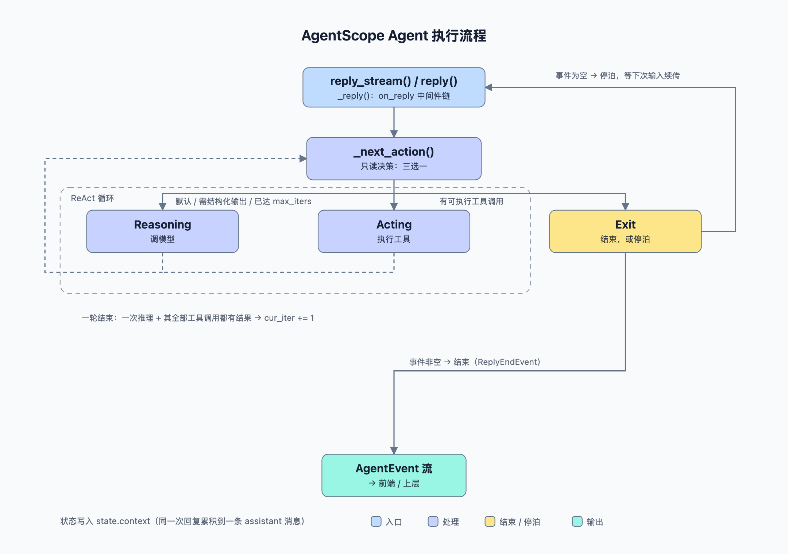

# 第 2 章 · 框架机制

> 本章只讲**机制**，不讲教程。每条结论都能在源码里指到出处（行号基于 `v2.0.8-77`）。

## 2.0 一句话总纲

**Agent = 一个只读决策器 + 一个纯副作用循环 + 一条单一事件流。**
状态收敛到 `state.context`，输出收敛成 `AgentEvent`，扩展点收敛成中间件。

## 2.1 四层架构

```
第4层  应用服务  app/            FastAPI 多租户服务 + Web UI + IM 通道 + 存储 + 调度
第3层  编排      pipeline/        GoalPipeline / A2A / agent team
第2层  能力      middleware/ rag/ workspace/ memory/ tts/ realtime/
第1层  内核      agent/ model/ tool/ message/ formatter/ event/ state/
```

读代码**必须按 1→4**，倒着读会到处踩空。

## 2.2 六个核心抽象

| 抽象 | 一句话 | 文件 | 关键点 |
|---|---|---|---|
| `Msg` | 唯一信息载体 | `message/_base.py:70` | 内容是 block 列表 |
| `AgentEvent` | 唯一对外输出 | `event/_event.py` | 流式事件，块级 Start/Delta/End 成对 |
| `Agent` | ReAct 循环执行体 | `agent/_agent.py:117` | 全仓最重的文件（3919 行） |
| `ChatModelBase` | LLM 抽象 | `model/_base.py:37` | `__call__` → 抽象 `_call_api` |
| `ToolBase`/`Toolkit` | 工具注册与执行 | `tool/_base.py:100`、`tool/_toolkit.py:66` | 并发/串行由工具声明决定 |
| `FormatterBase` | `Msg[]` → 各家 API dict | `formatter/_formatter_base.py:20` | 一个 provider 一个 formatter |

内容块类型（`message/_block.py`）：
`TextBlock` / `ThinkingBlock` / `HintBlock` / `ToolCallBlock` / `ToolResultBlock` / `DataBlock`。

## 2.3 主循环：一个三态机



> 图源 `study/images/agentscope-agent-flow.html`（矢量，浏览器直接打开）；改图后跑 `study/render-flow.sh` 重新导出 PNG。

```
reply_stream()  :288   ← 过滤掉 Msg，只吐事件
  └ reply()     :332   ← 消费整条流，取最后一个 Msg
     └ _reply() :892   ← 中间件洋葱 + _receive_reply_end
        └ _reply_impl() :1027   ← 真正的骨架
```

`_reply_impl` 的结构（注释里就写着 Step 1/2/3）：

| 阶段 | 做什么 |
|---|---|
| Step 1 | 输入分派：HITL 事件（确认/中断/外部结果） vs 新 `Msg` |
| Step 2 | 续传停泊的回复，或开新回复（`ReplyStartEvent`，按需注册结构化输出工具） |
| Step 3 | `while True`：`_next_action` 决策 → 执行 → 直到 Exit |

**循环体只有三种去向**（`agent/_agent.py:3492` 的 `_next_action`，只读）：

| 返回 | 条件 | 含义 |
|---|---|---|
| `Reasoning(hint, tool_choice)` | 默认 / 需要结构化输出 / `cur_iter == max_iters` | 调模型 |
| `Acting(tool_calls)` | 尾部 assistant 消息里有**可执行**的工具调用 | 执行工具 |
| `Exit(exit_events, exit_msg)` | 见下 | 结束 **或停泊** |

**`Exit` 有两种语义，这是最容易看漏的一点**：

- `exit_events` **为空** → **HITL 停泊**：回复**没结束**，在等权限确认或外部执行，靠下一次输入续传（`:1131` 处 `yield exit_msg; return`）。
- `exit_events` **非空** → 真结束：`COMPLETED` / `EXCEED_MAX_ITERS` / `INTERRUPTED`。

一轮的定义（`:1272`）：**一次推理 + 它产生的全部工具调用都拿到结果**才 `cur_iter += 1`。

## 2.4 事件系统

`*Start → *Delta* → *End` 严格成对，`_reasoning_impl` 用 `block_ids` 字典在流末补齐所有 `End` 事件
（`:1770` 附近）—— **前端不需要自己收尾**。

实测一次带工具的回复（48 事件）：

```
ReplyStart → HintBlock → ModelCallStart
  → Thinking/Text 增量 → ToolCallStart/Delta/End
  → ToolResultStart/TextDelta/End → HintBlock      ← 工具结果回灌
  → ModelCallStart → Text 增量 → ModelCallEnd → ReplyEnd
```

**两次 `ModelCallStart` = ReAct 两轮**。`Msg` 只在最后出现，它终止流。

## 2.5 三类内容载体：prompt / hint / thinking

同一个 `Msg` 里可能同时出现 `hint` 与 `thinking` 两种 block，而 system prompt 并不在其中 —— 三者最容易混。一句话区分：

- **prompt** —— 构造时定死的**输入**（`role: system`）
- **hint** —— 运行时按需注入的**输入**，到 API 时转成 `role: user`
- **thinking** —— 模型吐出的**输出**，且**不回传**给模型

### 方向与角色对照

| | hint | thinking | prompt |
|---|---|---|---|
| 方向 | 框架 → 模型 | 模型 → 框架/用户 | 宿主 → 模型 |
| 到 API 时 | 转成 `role: user`（`formatter/_openai_formatter.py:303-327`） | **被跳过**（`:391-393`） | `role: system` |
| 生成者 | 框架 / 中间件 / 工具 | 模型自身 | 开发者 |
| 流式形态 | 一次性全文，无 delta | 逐 token `delta` | — |
| 是否长留上下文 | 是，且**参与后续所有请求** | 留在 `Msg` 里供渲染/存档，但**不回传** | 是，常驻 |

`_openai_formatter.py:391-393` 原文说明了 thinking 的处境：

```python
elif isinstance(block, ThinkingBlock):
    # OpenAI API does not accept reasoning/thinking content
    # in conversation history — skip thinking blocks silently.
```

### hint 是 `Reasoning` 决策的一个字段

```python
def _next_action(self, final_msg=None) -> Reasoning | Acting | Exit:
    ...
    return Reasoning(
        hint=HintBlock(hint=[TextBlock(text="<system-reminder>...")]),
        tool_choice=...,
    )
```

`_next_action` 决定「这一轮去调模型」时，可以顺带挂一个 hint；循环体随后 `append_context(hint)` 写进上下文，再发起调用。

### 与 system prompt 的分工：为什么不直接改 prompt

`_inject_runtime_state` 的 docstring 把关卡写死了：

> We attach a HintBlock instead of mutating the system prompt, **so that prompt caching still works** while the agent remains aware of the changing time / tasks / context.
>
> Only information that *changes* within a conversation is injected here. **Fixed information should live in the system prompt.**

| | system prompt | hint |
|---|---|---|
| 装什么 | **不变的**：人设、总则、技能说明 | **会变的**：当前时间、任务状态、上下文余量、工具连续失败 |
| 什么时候给 | 构造时一次 | 运行时按条件注入（每轮可选） |
| API 角色 | `system` | `user` |
| 缓存影响 | 稳定 → prompt cache 可命中 | 追加在对话尾部，**不污染 system**，缓存照旧命中 |

一句话：**改 system prompt 会废掉整段前缀的缓存，所以「会变的」一律走 hint。**

### 谁在造 hint

| 触发 | 位置 | 注入内容 |
|---|---|---|
| 达到 `max_iters` | `agent/_agent.py:3700` | 「总结并给最终答案，别调工具」 |
| 要求结构化输出 | `agent/_agent.py:3630` | 「调用生成工具产出结构化结果」 |
| 运行时状态 | `_inject_runtime_state`（`agent/_agent.py:1610`） | 时间 / 任务 / 上下文余量 / 工具连续失败 |
| 上下文压缩 | `agent/_agent.py:877` | 被移除图片的替代说明 |
| 中间件 | `middleware/_rag.py:989`、`middleware/_budget.py:180`、长期记忆 | 检索结果、预算告警、记忆召回 |
| 服务层 | team / inbox / tool_offload / scheduler / IM 网关 | 团队消息、收件箱、工具卸载、定时唤醒 |

### 为什么 hint 要独立成一个 block 类型

既然最终都变成 user 消息，为何不直接 append 一条 user `Msg`：

1. `source` 字段标明「这不是用户说的」；
2. 事件流里 `HintBlockEvent` 与真实用户输入天然可区分 —— 它是**无 delta 的一次性事件**（`message/_base.py:376` 注释：「One-shot event」）；
3. 前端可单独渲染（灰底提示条 vs 用户气泡）；
4. `InjectionConfig.emit_hint_event` 一个开关控制是否对外发事件。

## 2.6 工具与批处理（对写自有工具最关键）

`_batch_tool_calls`（`:2088`）按工具的 `is_concurrency_safe` 分批：

```
未注册/不可用 或 is_concurrency_safe=True  → concurrent 批
否则（有副作用）                           → sequential 批
同类型「相邻」的合并，类型一变就开新批
```

效果：`Read/Grep/Glob` 自动并发，`Write/Edit/Bash` 自动串行且**保持模型给的相对顺序**。

> **对 hgt-2 的含义**：`is_concurrency_safe` / `is_read_only` 是**正确性开关**，不是性能开关。
> 声明错了会真的乱序或该串行的并发执行。`is_read_only` 还直接参与权限判定。

工具执行的链路：`_execute_tool_call`（`:2423`，权限检查）→ `_acting`（`:2711`，`on_acting` 中间件）
→ `_acting_impl`（`:2765`，`toolkit.call_tool`）。

## 2.7 中间件：洋葱 + 可"续命"循环

七类钩子：`on_reply` / `on_reasoning` / `on_acting` / `on_model_call` /
`on_check_permission` / `on_compress_context` / `on_system_prompt`。
Agent 构造时按实现的钩子筛选（`agent/_agent.py:206` 起）。

**`_receive_reply_end`（`:965`）是个官方后门**：`_reply` 在 yield `ReplyEndEvent` 前把它置 True；
中间件只要**收到但不 yield** 这个事件，标志保持 False → 主循环拒绝退出、强制再来一轮。
配套 `made_progress`（`:1129`）防忙循环：连续吞两次且中间没有推理/执行 → `RuntimeError`。

## 2.8 状态与上下文

| 对象 | 位置 | 作用 |
|---|---|---|
| `AgentState.context` | `state/_state.py:209` | 消息列表，**一次回复累积进一条 assistant 消息** |
| `ReplyContext` | `:182` | `reply_id` / `cur_iter` / `structured_schema` / `structured_output` |
| `append_context` | `:298` | 把 block 追加进当前 reply 的那条消息（不存在就新建） |
| `get_unfinished_tool_calls` | `:374` | 没有配对结果的工具调用 —— 决定一轮是否结束 |

上下文自我管理都在循环里：**压缩（`compress_context`）发生在推理之前**（`:1179`），
之后是运行时状态注入（时间 / 任务 / 上下文用量）。

## 2.9 人在环（HITL）

停泊 → 续传是完整闭环：

1. 工具 `check_permissions` 返回 ASKING → `Exit(exit_events=None)` 停泊；
2. 外部拿 `RequireUserConfirmEvent` 去问人；
3. 用户答复后用 `UserConfirmResultEvent` 喂回 `reply()` → `_handle_incoming_event` 续传。

中断时框架会给未完成的工具调用**补一条 `INTERRUPTED` 结果**（`_close_unfinished_tool_calls` `:962`），
保证"每个 tool_call 都有配对结果"，下次输入才能被正常处理。

`UserInterruptEvent` 短路（`:1079`）：只有真存在 awaiting 工具调用时才收尾，否则是无害 no-op。

## 2.10 结构化输出

按需挂载：每次回复先 `remove_tool(_GenerateStructuredOutput)`，若有 schema 再 add 一个
带 schema 的新实例（`:1115`）。`_next_action` 里若"要求了但没满足"，就注入一条
`<system-reminder>` 提示模型调用它；超出 `max_iters + structured_output_grace_iters`
则结束并报 `EXCEED_MAX_ITERS`。

## 2.11 `max_iters` 的真实语义

**不是"最多推理 N 次"**，而是"第 N 次进入时**强制一次不许调工具**的收尾调用"
（`:3712`，`tool_choice=ToolChoice(mode="none")`）。

所以正常流程 `final_msg` 出现在 `cur_iter == max_iters + 1`；判超限用的才是 `>`。

## 2.12 可替换性：最小协议

`PipelineProtocol`（`pipeline/_base.py:11`）**只有一个方法**：

```python
def reply_stream(self, inputs) -> AsyncGenerator[AgentEvent | Msg, None]
```

任何满足它的东西都能顶替 `Agent` —— `GoalPipeline`、`A2AAgent` 都是这么做的。
这是整个框架可组合性的地基。

## 2.13 代码地图

| 想找 | 去哪 |
|---|---|
| 主循环骨架 | `agent/_agent.py:1027`（`_reply_impl`） |
| 决策规则 | `agent/_agent.py:3492`（`_next_action`） |
| 调模型 | `agent/_agent.py:1690`、`:3271` |
| 工具分批 | `agent/_agent.py:2088` |
| 权限 | `agent/_agent.py:2404`、`permission/` |
| 配置项 | `agent/_config.py`（`ContextConfig:51` / `InjectionConfig:195` / `ReActConfig:362` / `ModelConfig:415`） |
| 事件类型 | `event/_event.py` |
| 内容块 | `message/_block.py` |
| 工具契约 | `tool/_base.py:100` |
| 模型契约 | `model/_base.py:37` |
| 服务层入口 | `app/_app.py` |

上一章：[第 1 章 · 快速上手](01-quickstart.md)
